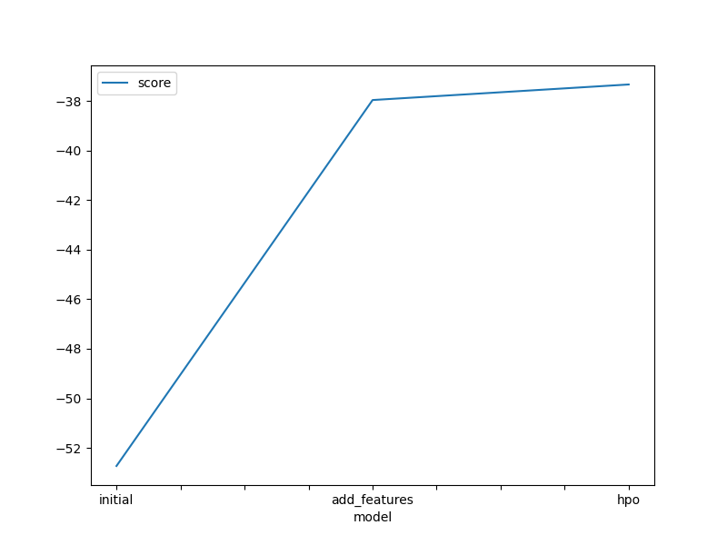
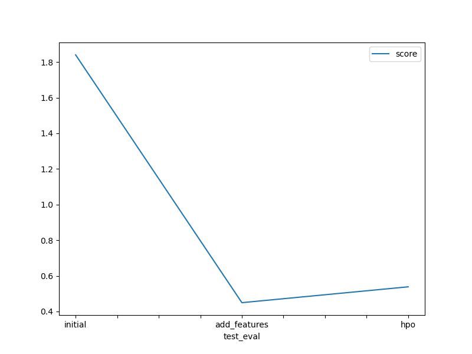

# Report: Predict Bike Sharing Demand with AutoGluon Solution
#### Barah Qusai 

## Initial Training
### What did you realize when you tried to submit your predictions? What changes were needed to the output of the predictor to submit your results?

While submitting the predictions, I faced challenges such as linking my Kaggle account and working within the SageMaker environment, in addition to initially poor results. It required adjusting the predictions to eliminate negative values and improving the model through feature engineering and hyperparameter tuning. This helped enhance accuracy and deepen my understanding of the process

### What was the top ranked model that performed?

The best-performing model was WeightedEnsemble_L3, with a Kaggle score of 0.44957. It was built using data exploration and feature engineering without hyperparameter tuning

## Exploratory data analysis and feature creation
### What did the exploratory analysis find and how did you add additional features?
The analysis showed that the datetime feature holds valuable time-related information. I extracted features like year, month, weekday, and hour. Also, categorical variables like season and weather were converted to "category" dtype to be properly handled by AutoGluon.

### How much better did your model preform after adding additional features and why do you think that is?
The score improved significantly from 1.84007 to 0.44957 after adding features, due to richer information that helped the model detect patterns more effectively.

## Hyper parameter tuning
### How much better did your model preform after trying different hyper parameters?
Hyperparameter tuning slightly decreased performance compared to the best model with added features but was still better than the default model. This shows that tuning can still be beneficial overall.

### If you were given more time with this dataset, where do you think you would spend more time?
If I had more time, I would try running AutoGluon for longer periods with high-quality settings and improved hyperparameter tuning to achieve better results. I would also explore using models like XGBoost to further enhance performance.

### Create a table with the models you ran, the hyperparameters modified, and the kaggle score.
|model|hpo1|hpo2|hpo3|score|
|--|--|--|--|--|
|initial|?|?|?|?|
|add_features|?|?|?|?|
|hpo|?|?|?|?|

### Create a line plot showing the top model score for the three (or more) training runs during the project.

TODO: Replace the image below with your own.

### Create a line plot showing the top kaggle score for the three (or more) prediction submissions during the project.

TODO: Replace the image below with your own.

## Summary
I conducted three experiments using AutoGluon: the first with default parameters achieved a score of 1.84007; the second added new features from the datetime data, improving the score to 0.44957; and the third involved hyperparameter tuning, which slightly lowered the performance to 0.53849 but still outperformed the initial run. These results highlight the importance of feature engineering and parameter tuning in improving model accuracy.

